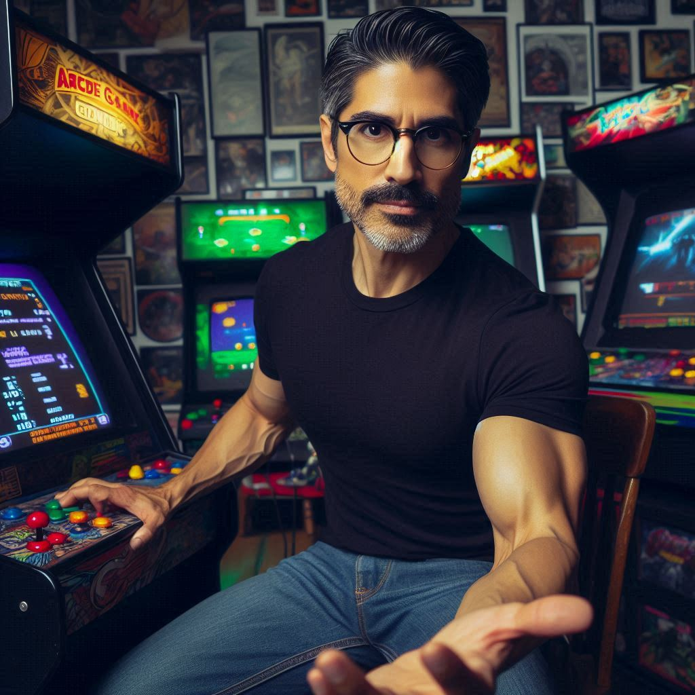
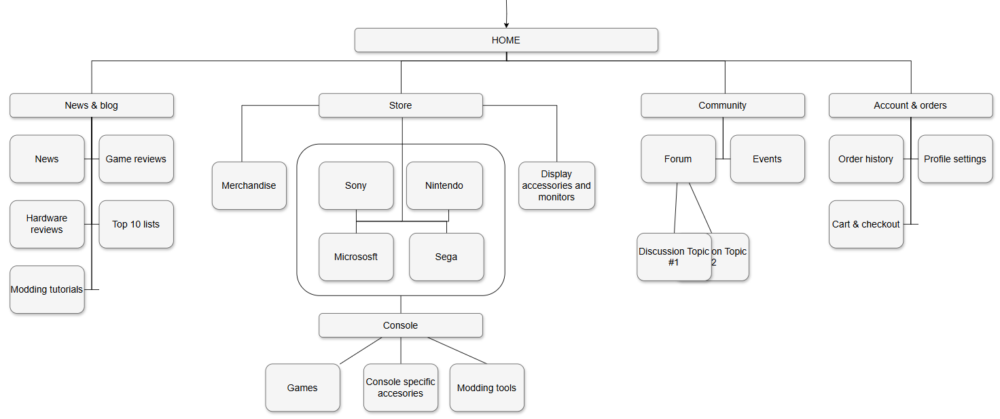

User personas
---
#### chat.gpt prompt

"Create 3 user personas with demographic details, personality traits, and context-specific information for a retro gaming website which has a blog about different gaming topics and news. The site may also have a store for various retro gaming hardware"
### Persona 1: **Nostalgic Collector**

- **Name:** Mark Jennings
- **Age:** 42
- **Occupation:** Software Developer
- **Location:** Austin, Texas, USA
- **Income Level:** $90,000/year

#### Demographic Details:
- **Education:** Bachelor’s degree in Computer Science
- **Family Status:** Married, two kids (ages 10 and 7)

#### Personality Traits:
- **Hobbies:** Collecting vintage consoles, coding, reading sci-fi novels
- **Tech-Savvy Level:** Advanced, but prefers simpler interfaces reminiscent of the '90s web
- **Values:** Nostalgia, preservation of gaming history, quality over quantity
- **Personality:** Loyal, detail-oriented, enthusiastic about retro gaming

#### Context-Specific Information:
- **Goals:** Mark is looking to expand his collection of vintage consoles and accessories. He’s also interested in DIY projects, so any guides on restoring or modifying retro gaming hardware will catch his attention.
- **Pain Points:** Wants authentic hardware but is frustrated by the inflated prices of rare items. Often worries about the authenticity and condition of the hardware he buys online.
- **Preferred Content:** Blog articles on the history and evolution of retro gaming, comparison guides for different consoles, and tutorials on restoring old hardware. He also loves seeing "Top 10" lists and memory-lane blog posts about old gaming systems.
- **Shopping Interests:** Quality assured retro consoles (like NES, Atari), original game cartridges, and repair tools. Mark will likely spend on high-quality, rare hardware if he trusts the site’s authenticity.

---

### Persona 2: **Curious Newcomer**

- **Name:** Sarah Kim
- **Age:** 24
- **Occupation:** Social Media Manager
- **Location:** Los Angeles, California, USA
- **Income Level:** $50,000/year

#### Demographic Details:
- **Education:** Bachelor’s degree in Marketing
- **Family Status:** Single

#### Personality Traits:
- **Hobbies:** Cosplay, anime conventions, mobile gaming, exploring different cultures
- **Tech-Savvy Level:** Intermediate, comfortable with modern tech but newer to retro gaming
- **Values:** Aesthetics, affordability, discovery of new subcultures
- **Personality:** Curious, playful, loves novelty, and is active on social media

#### Context-Specific Information:
- **Goals:** Sarah wants to understand why retro gaming is so popular and experience it firsthand. She's interested in buying a vintage handheld console like a Game Boy or NES and wants affordable, beginner-friendly recommendations.
- **Pain Points:** She finds it hard to differentiate between authentic hardware and modern replicas. She also doesn’t want to spend much on games or consoles that might end up being overly complex.
- **Preferred Content:** Blog posts introducing retro gaming for beginners, top games to try from each era, and articles on the influence of retro gaming on pop culture. She would also be interested in articles that compare retro games to current titles.
- **Shopping Interests:** Affordable starter consoles, "mini" replicas of original consoles, refurbished handhelds, or even emulator-compatible controllers. Sarah’s purchases may depend on recommendations and visual appeal.

---

### Persona 3: **Competitive Retrogamer**

- **Name:** Carlos Alvarez
- **Age:** 35
- **Occupation:** IT Consultant
- **Location:** Toronto, Canada
- **Income Level:** $75,000/year

#### Demographic Details:
- **Education:** Associate’s degree in Information Technology
- **Family Status:** In a relationship, no children

#### Personality Traits:
- **Hobbies:** Retro gaming tournaments, arcade visits, esports, fitness
- **Tech-Savvy Level:** High, with a focus on performance and hardware
- **Values:** Challenge, competition, skill mastery
- **Personality:** Competitive, driven, analytical, loves community events

#### Context-Specific Information:
- **Goals:** Carlos aims to enhance his skills in classic arcade games and enjoys reliving the challenge of his favorite old-school titles. He frequently competes in online retro gaming tournaments and seeks top-tier hardware for the best gaming experience.
- **Pain Points:** He finds it challenging to source well-maintained, high-performance hardware like joysticks, arcade pads, and CRT monitors.
- **Preferred Content:** Detailed guides on improving retro gaming skills, arcade game tips, reviews of controllers and accessories, and breakdowns of the hardest retro games to conquer. Community articles or forums discussing high scores and game records would appeal to him.
- **Shopping Interests:** Premium retro gaming controllers, arcade pads, CRT or retro-compatible monitors, and any high-quality original hardware that would give him an edge in competitions.

---
## Sitemap

